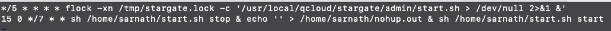

#### Ubuntu系统定时任务

使用 crontab 来执行定时任务

##### 编辑定时任务

```
crontab -e
```

##### 添加定时任务

这里以添加一条命令来展示

要执行的命令：先停止服务，然后清空nohup.out文件，最后启动服务

```
sh /home/sarnath/start.sh stop & echo '' > /home/sarnath/nohup.out & sh /home/sarnath/start.sh start
```

定时任务执行时间：每7天0时15分执行

```
15 0 */7 * *
```

完整命令如下

```
15 0 */7 * * sh /home/sarnath/start.sh stop & echo '' > /home/sarnath/nohup.out & sh /home/sarnath/start.sh start
```



##### 重载定时任务配置

```
service crond reload
```

