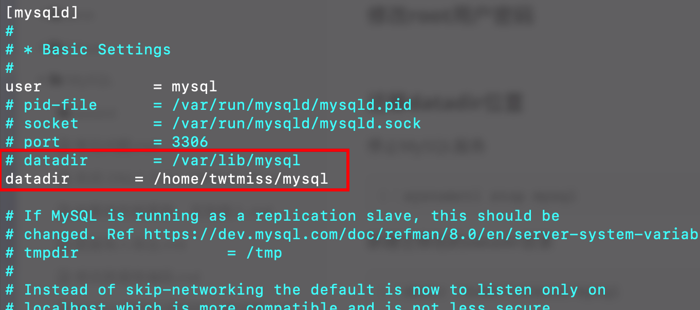
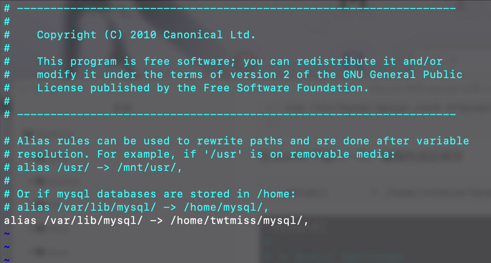

### Ubuntu Server20.04修改MySQL8 datadir位置

> MySQL版本：8.0.28
>
> Ubuntu版本：Ubuntu Server20.04

#### 安装MySQL8

```
apt install mysql-server
```

#### 修改root用户密码


#### 迁移datadir位置

停止MySQL服务

```
systemctl stop mysql
```

新建迁移后的datadir目录

```
mkdir /home/twtmiss/mysql
```

修改MySQL配置文件

```
vim /etc/mysql/mysql.conf.d/mysqld.cnf
```

在datadir下插入一行，编辑完成后保存

```
datadir       = /home/twtmiss/mysql
```



复制数据文件，**此处一定要跟上`-a`参数，不然复制过去的目录没有权限**

```
cp -a -r /var/lib/mysql /home/twtmiss/
```

修改新目录的权限

```
chown -R mysql:mysql /home/twtmiss/mysql
```

修改apparmor

要通过在默认目录和新位置之间创建别名来告诉AppArmor让MySQL写入新目录。需要编辑apparmor alias文件

```
vim /etc/apparmor.d/tunables/alias
```

在文件底部添加

```
alias /var/lib/mysql/ -> /home/twtmiss/mysql/,
```



重启apparmor服务

```
systemctl restart apparmor
```

启动MySQL

```
systemctl start mysql
```

登录后查看目录是否生效

```
show global variables like "%datadir%";
```

