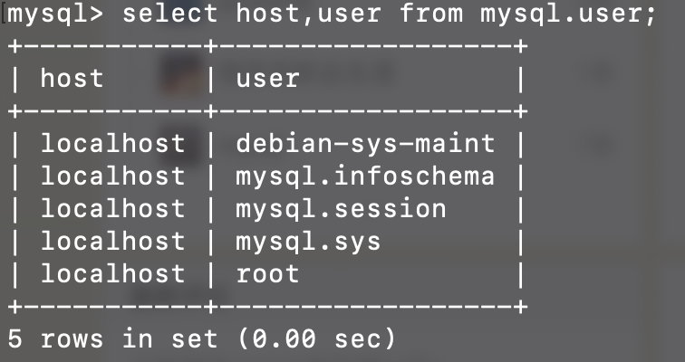
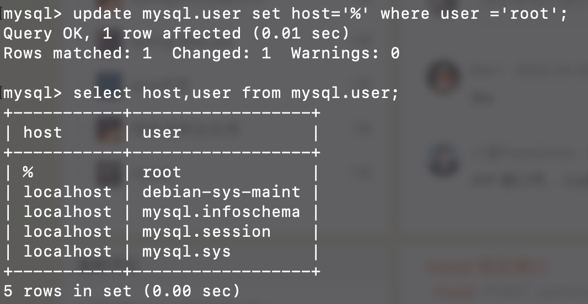
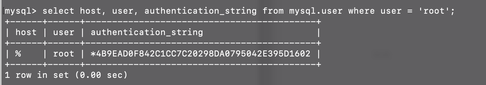

#### MySQL配置文件位置

Ubuntu系统使用apt安装MySQL8

```
/etc/mysql/mysql.conf.d/mysqld.cnf
```


#### root用户远程登录

查看root用户host

```
select host,user from mysql.user;
```



修改host

```
update mysql.user set host='%' where user ='root';
```




#### 修改root用户密码

该命令执行后可能会没有生效（这里的root用户host为localhost，如果被修改了也需要相应的修改）

```
alter user 'root'@'localhost' identified by 'newPassword';
```

若没有修改成功使用该命令

```
ALTER USER 'root'@'localhost' IDENTIFIED WITH mysql_native_password BY 'newPassword';
```

**查询密码是否不为空，如果`authentication_string`字段为空，远程将无法连接成功，会提示`Access denied for user `**

```
select host, user, authentication_string from mysql.user where user = 'root';
```

