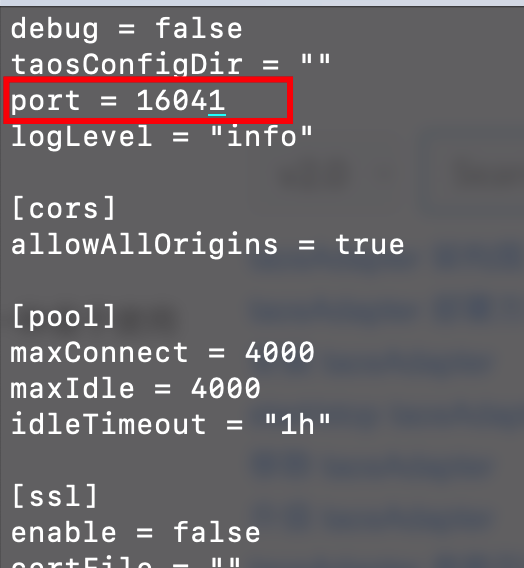
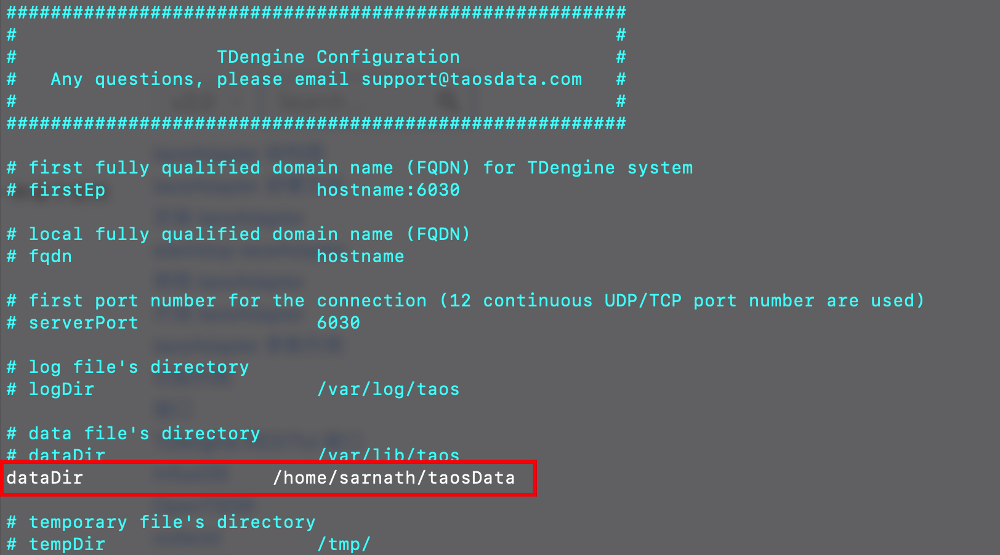

#### Tdengine文件目录结构

| 目录/文件                 | 说明                                                         |
| ------------------------- | ------------------------------------------------------------ |
| /usr/local/taos/bin       | TDengine可执行文件目录。其中的执行文件都会软链接到/usr/bin目录下。 |
| /usr/local/taos/connector | TDengine各种连接器目录。                                     |
| /usr/local/taos/driver    | TDengine动态链接库目录。会软链接到/usr/lib目录下。           |
| /usr/local/taos/examples  | TDengine各种语言应用示例目录。                               |
| /usr/local/taos/include   | TDengine对外提供的C语言接口的头文件。                        |
| /etc/taos/taos.cfg        | TDengine默认[配置文件]                                       |
| /var/lib/taos             | TDengine默认数据文件目录,可通过[配置文件]修改位置.           |
| /var/log/taos             | TDengine默认日志文件目录,可通过[配置文件]修改位置            |

##### 可执行文件

TDengine的所有可执行文件默认存放在 */usr/local/taos/bin* 目录下。其中包括：

- *taosd*：TDengine服务端可执行文件
- *taos*： TDengine Shell可执行文件
- *taosdump*：数据导入导出工具
- remove.sh：卸载TDengine的脚本, 请谨慎执行，链接到/usr/bin目录下的rmtaos命令。会删除TDengine的安装目录/usr/local/taos，但会保留/etc/taos、/var/lib/taos、/var/log/taos。

#### 修改密码

`alter user root pass 'root!@#123'`

#### 修改RestFul端口

taosAdapter包含在2.3.0.0及以上版本中，确保Tdengine版本高于2.3.0.0。https://www.taosdata.com/docs/cn/v2.0/tools/adapter

taosAdapter配置文件位置：`/etc/taos/taosadapter.toml`

修改`taosadapter.toml`文件，修改`port`配置为指定端口号



修改完成后重启 taosadapter

```
systemctl restart taosadapter
```

查看 taosadapter 状态

```
systemctl status taosadapter
```


#### 修改Tdengine数据库文件

Tdengine配置文件默认位置：`/etc/taos/taos.cfg`,https://www.taosdata.com/docs/cn/v2.0/administrator#-8

修改`dataDir`配置为指定目录



修改完成后重启 taosd

```
systemctl restart taosd
```

查看 taosadapter 状态

```
systemctl status taosd
```

